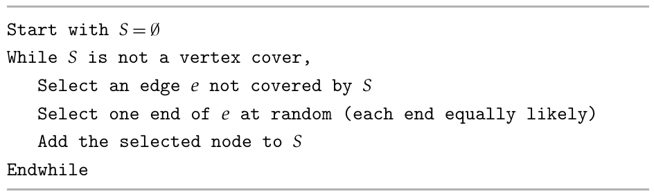

# Final Exam(100pts,3hrs)

## General Information
- **Date:** 2026.01.05
- **Time:** 14:30-17:30
- **Format:** Closed-book exam; however, one double-sided A4 page of **handwritten** notes is allowed.

**Problem 1 (10 pts)**
Solve the following recurrence relations:
- $f(n) = 3 f(\frac{n}{2}) + \log n$
- $f(n) = 2 f(n^{\frac{2}{3}}) + n \log n$

**Problem 2 (10 pts)**
We’re looking at the price of a given stock over $n$ consecutive days, numbered $i = 1, 2, \dots, n$. For each day $i$, we have a price $p(i)$ per share for the stock on that day. (We’ll assume for simplicity that the price was fixed during each day.) We’d like to know: How should we choose a day $i$ on which to buy the stock and a later day $j > i$ on which to sell it, if we want to maximize the profit per share, $p(j) - p(i)$? (If there is no way to make money during the $n$ days, we should conclude this instead.)

**Problem 3 (15 pts)**

**(a)** Given an undirected graph $G=(V,E)$ and two distinct vertices $s, t \in V$, find a set of paths $\mathcal{P} = \{P_1, \ldots, P_k\}$ such that:

1. Every $P_i \in \mathcal{P}$ is a path from $s$ to $t$.
2. For any distinct indices $i, j$, the paths $P_i$ and $P_j$ are internally vertex-disjoint.
3. The size of the set, $k = |\mathcal{P}|$, is maximized.

**(b)** (and probably (c)?) This question involves proving a NPC problem.

**Problem 4 (5 pts)**

Given a list of $n$ natural numbers $d_1, d_2, \dots, d_n$, show how to decide in polynomial time whether there exists an undirected graph $G = (V, E)$ whose node degrees are precisely the numbers $d_1, d_2, \dots, d_n$. (That is, if $V = \{v_1, v_2, \dots, v_n\}$, then the degree of $v_i$ should be exactly $d_i$.) $G$ should not contain multiple edges between the same pair of nodes, or “loop” edges with both endpoints equal to the same node.

**Problem 5 (5 pts)**

Given an unsorted array $A$ containing $n$ distinct integers, design an algorithm to determine the length of the longest set of elements in $A$ that form a consecutive sequence of integers.

*Note: The elements do not need to be adjacent or in ascending order within the original array $A$ to be considered part of the sequence.*

---

**Please answer 3 of the following 4 questions (Problems 6–9). If you answer more than 3, we will grade the 3 problems with the highest scores.**

**Problem 6 (10 pts)**

Suppose $A$ is an $N \times N$ matrix containing $N^2$ distinct integers ranging from 1 to $N^2$. You can query $A(i, j)$ to get the number at row $i$ and column $j$. In this problem, you need to run an algorithm to find a local optimum $(\hat{x}, \hat{y})$ in matrix $A$. A grid cell $(\hat{x}, \hat{y})$ for some $1 \leq \hat{x}, \hat{y} \leq N$ is called a local optimum if:

$$A(\hat{x}, \hat{y}) < \min \{A(\hat{x} - 1, \hat{y}), A(\hat{x} + 1, \hat{y}), A(\hat{x}, \hat{y} - 1), A(\hat{x}, \hat{y} + 1)\}$$

For convenience, assume $A(i, 0) = A(i, N + 1) = A(0, i) = A(N, i) = +\infty$ for any $1 \leq i \leq N$.

*(Hint: There is no dependency between the questions below, so you can solve them in any order.)*

**(a)** Gradient descent is a popular method for finding local optima. Specifically, we can start from any coordinate $(x_0, y_0)$ and, in each following step $t > 0$, find a neighboring grid cell $(x_t, y_t)$ (i.e., $|x_t - x_{t-1}| + |y_t - y_{t-1}| = 1$) satisfying $A(x_t, y_t) < A(x_{t-1}, y_{t-1})$. (**If there is more than one such neighboring grid cell, choose an arbitrary one.**) We repeat this process until $(x_t, y_t)$ becomes a local optimum.

Despite its simplicity, gradient descent may not be an efficient algorithm. Please construct a counterexample such that the above gradient descent algorithm requires querying $O(N^2)$ grid cells to find a local optimum. For convenience, you may assume we always start from $(x_0 = 1, y_0 = 1)$.

**(b)** Propose an efficient algorithm that can find a local optimum in $o(N^2)$ time. *(Hint: Querying $O(N)$ grid cells is sufficient).*

**Problem 7 (15 pts)**

In this problem, we will consider the following simple randomized algorithm for the Vertex Cover Algorithm. 

We will be interested in the expected cost of a vertex cover selected by this algorithm.

**(a)** Is this algorithm a $c-$approximation algorithm for the Minimum Weight Vertex Cover Problem for some constant $c$? Prove your answer.

**(b)** Is this algorithm a $c-$approximation algorithm for the Minimum Cardinality Vertex Cover Problem for some constant $c$? Prove your answer.

(*Hint:* For an edge, let $p_e$ denote the probability that edge $e$ is selected as an uncovered edge in this algorithm. Can you express the expected value of the solution in terms of these probabilities? To bound the value of an optimal solution in terms of the $p_e$ probabilities, try to bound the sum of the probabilities for the edges incident to a given vertex $v$, namely, $\sum_{e \text{ incident to } v} p_e$.)

**Problem 8 (15 pts)**

There is a coin with a bias $\delta > 0$; that is, it has a probability of $0.5+\delta$ of landing on one side (e.g., heads) versus the other. You need to determine which side is biased.

**(1)** If you know $\delta$, prove you can determine the biased side with success probability $>0.99$ in $O(\delta^{-2})$ tosses. (2 pts)

**(2)** If you don't know $\delta$, prove you can determine the biased side with success probability $>0.99$ in $O(\delta^{-2} \log \log \delta^{-1})$ tosses. *(Hint: Guess $\delta$.)* (3 pts)

**Problem 9 (15 pts)**

There is a set of pages $P = \{1, 2, \ldots, n\}$ that can be broadcast by a server. Assume that time is discrete and there are $T$ time slots. At each time slot, the broadcast server can broadcast exactly one page and all users receive that page. There are several users. Each user $u$ is associated with a page $p_u \in P$ and a time interval $[b_u, e_u]$. User $u$ is satisfied if the server broadcasts page $p_u$ any time during $[b_u, e_u]$.

Design an algorithm to schedule the broadcast server in order to satisfy as many users as possible.
The problem is NP-hard (you do not have to prove it). Design a poly-time approximation algorithm
that can achieve a constant factor approximation ratio.

**Problem 10 (15 pts)**

(Approximate Counting 0-1 KNAPSACK) For the 0-1 KNAPSACK problem, we are given a set of $n$ objects of weight $0 \le a_1 \le a_2 \le \dots \le a_n \le b$, and the capacity $C$. All these numbers are positive integers.

**(1)** We want to count the number $N$ of the subsets $S$ such that $\sum_{i \in S} a_i \le C$. Your algorithm can run in pseudopolynomial time (i.e., $\text{poly}(n, C)$).

**(2)** We would like to uniformly sample one solution from all possible solutions to $\sum_{i \in S} a_i \le C$ (i.e., each subset $S$ is sampled with probability $1/N$). Show how to do this in pseudopolynomial time.

**(3)** We are given a very large set $U$. We can take samples uniformly from $U$. Suppose you want to estimate the cardinality of a subset $T \subset U$. For any element $u \in U$, you can determine whether $u \in T$ or not in $O(1)$ time. Suppose $|U|/|T| = \alpha$. Show that it is possible to estimate the cardinality of a subset $T$ with $\varepsilon$ relative error with probability $1 - \delta$ using $\text{poly}(\alpha, \varepsilon^{-1}, \log \frac{1}{\delta})$ time.

**(4)** Design a $\text{poly}(n, \varepsilon^{-1}, \log \frac{1}{\delta})$ algorithm to approximate the number $N$ with $\varepsilon$ relative error with probability $1 - \delta$.

*(hint: first create a scaled problem as follows: Let $a'_i = \lfloor n^2 a_i / b \rfloor$. Let $N'$ be the number of subset $S$ such that $\sum_{i \in S} a'_i \le n^2$. Show that $N' \le (n + 1)N$. For any solution in the scaled problem, show that we can delete at most 1 element to meet the original constraint.)*